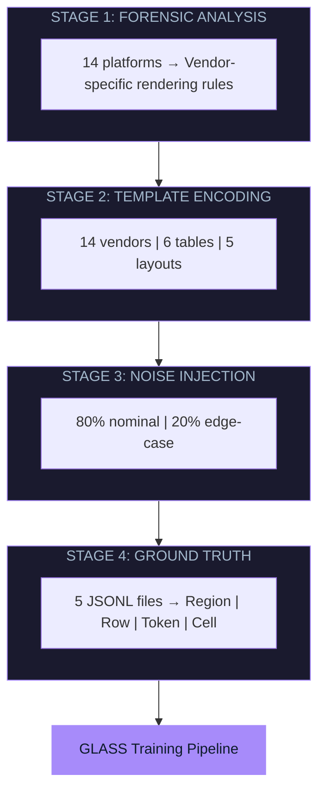
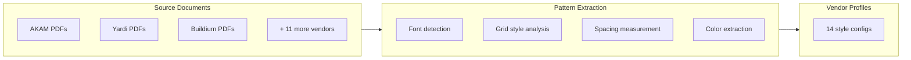
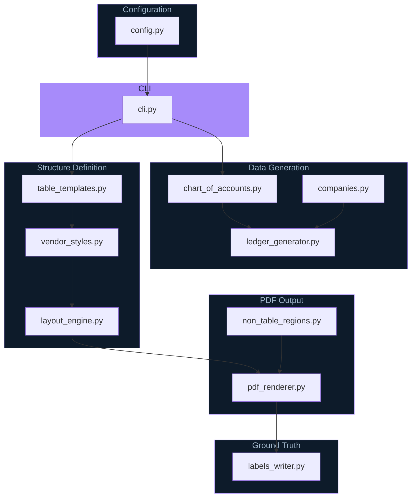
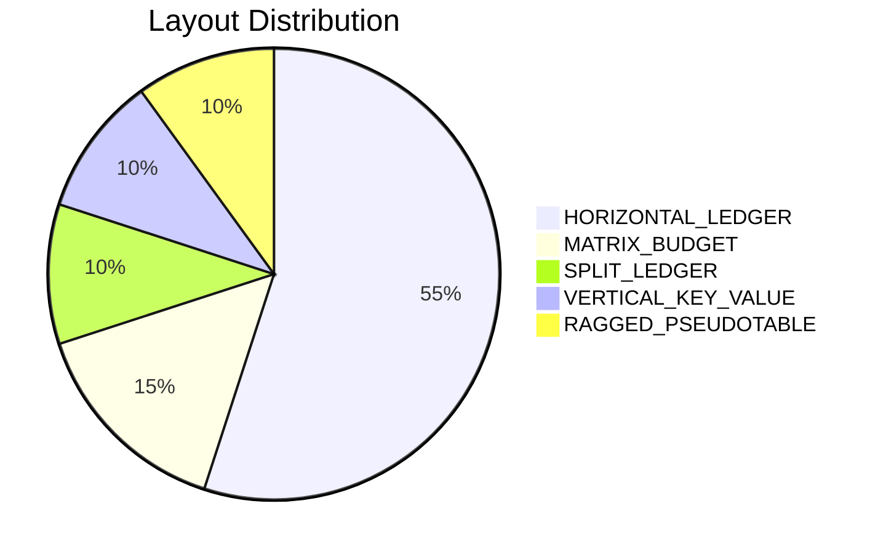
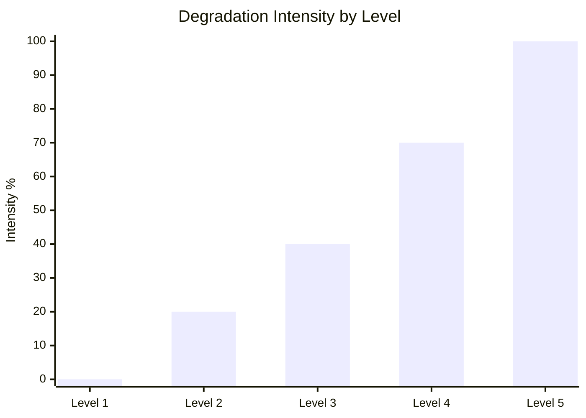
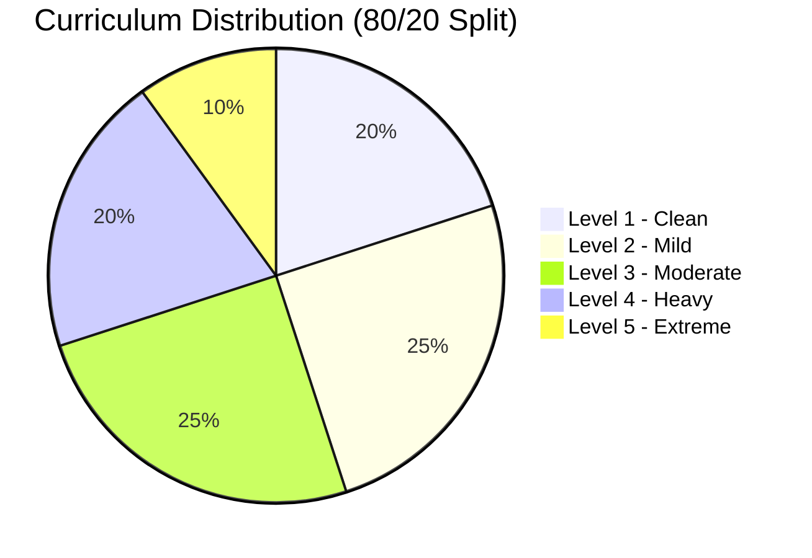
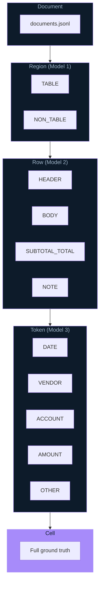

# Architecture

## System Overview

The PDF Synth Engine is a four-stage pipeline that reverse-engineers real PDF construction mechanisms to generate structurally accurate synthetic training data.



---

## Stage 1: Forensic Analysis

**Objective:** Extract structural patterns from real property management software outputs



**Analyzed Platforms:**

| Platform | Font | Grid Style | Header Color |
|----------|------|------------|--------------|
| AKAM_OLD | Courier | FULL_GRID | #D0D0D0 |
| AKAM_NEW | Helvetica | HORIZONTAL_ONLY | #E8E8E8 |
| DOUGLAS | Times-Roman | BOX_BORDERS | #F0F0F0 |
| FIRSTSERVICE | Helvetica | ALTERNATING_ROWS | #2C5282 |
| LINDENWOOD | Helvetica | MINIMAL | #FFFFFF |
| YARDI | Helvetica | FULL_GRID | #EEEEEE |
| APPFOLIO | Helvetica | HORIZONTAL_ONLY | #FFFFFF |
| BUILDIUM | Helvetica | ALTERNATING_ROWS | #4A5568 |
| MDS | Courier | FULL_GRID | #CCCCCC |
| CINC | Helvetica | MINIMAL | #F5F5F5 |
| OTHER_1-4 | Mixed | Mixed | Mixed |

**Grid Style Definitions:**
- **FULL_GRID**: All horizontal + vertical lines
- **HORIZONTAL_ONLY**: Row separator lines only
- **MINIMAL**: Header/footer lines only
- **ALTERNATING_ROWS**: Zebra striping (no vertical lines)
- **BOX_BORDERS**: Outer border + header separator

---

## Stage 2: Template Encoding

**Objective:** Encode discovered patterns into executable generation rules

### Module Pipeline



### Module Responsibilities

| Module | Size | Primary Responsibility |
|--------|------|------------------------|
| `pdf_renderer.py` | 117 KB | Core PDF generation with ReportLab; handles all 5 layout types |
| `table_templates.py` | 24 KB | 6 table type schemas; column specifications |
| `labels_writer.py` | 20 KB | 5 JSONL output formats |
| `cli.py` | 15 KB | Document generation orchestration; sampling logic |
| `ledger_generator.py` | 15 KB | Financial transaction synthesis |
| `companies.py` | 11 KB | Company entity generation |
| `layout_engine.py` | 11 KB | Page layout computation; bbox calculation |
| `non_table_regions.py` | 11 KB | Non-table content generation |
| `vendor_styles.py` | 9 KB | 14 vendor visual profiles; grid styles |
| `degradation.py` | 6 KB | Parametric degradation engine |
| `chart_of_accounts.py` | 5 KB | GL code generation |
| `config.py` | 5 KB | YAML configuration loading |

### Table Types

| Type | Description | Columns |
|------|-------------|---------|
| CASH_OUT | Schedule B - Disbursements | Date, Vendor, GL Code, Check #, Amount, Balance |
| CASH_IN | Schedule D - Receipts | Date, Unit, Owner, GL Code, Receipt #, Amount |
| BUDGET | Income Statement | Account, Current, YTD Actual, YTD Budget, Variance |
| UNPAID | Open Payables | Date, Vendor, Invoice #, Due Date, Amount |
| AGING | AR Aging | Unit, Owner, Current, 30/60/90 Days, Total |
| GL | General Ledger | Date, Reference, Debit, Credit, Balance |

### Layout Types



| Layout | Distribution | Rendering Method |
|--------|--------------|------------------|
| HORIZONTAL_LEDGER | 55% | Standard row-based table |
| MATRIX_BUDGET | 15% | GL x Period cross-tab |
| SPLIT_LEDGER | 10% | Two tables side-by-side |
| VERTICAL_KEY_VALUE | 10% | Stacked label/value pairs |
| RAGGED_PSEUDOTABLE | 10% | Intentional misalignment |

---

## Stage 3: Noise Injection

**Objective:** Apply parametric degradation to simulate real-world document quality

### Degradation Parameters



| Parameter | Level 1 (Clean) | Level 3 (Moderate) | Level 5 (Extreme) |
|-----------|-----------------|--------------------|--------------------|
| Position Jitter | 0.0 pt | 2.0 pt | 5.0 pt |
| Font Size Range | 1.0x | 0.90-1.10x | 0.80-1.25x |
| Grid Line Prob | 100% | 85% | 50% |
| Row Height Range | 1.0x | 0.90-1.10x | 0.75-1.30x |
| Cell Padding | 1.0x | 0.80-1.20x | 0.40-1.60x |
| Column Width Var | 0% | 8% | 18% |
| Alignment Jitter | 0% | 5% | 15% |

### Stratified Curriculum



| Level | Percentage | Category |
|-------|------------|----------|
| 1 | 20% | Nominal |
| 2 | 25% | Nominal |
| 3 | 25% | Nominal |
| 4 | 20% | Edge-case |
| 5 | 10% | Edge-case |

**Curriculum Split:** 70% nominal (Levels 1-3), 30% edge-case (Levels 4-5)

---

## Stage 4: Ground Truth Generation

**Objective:** Generate pixel-perfect labels at four hierarchy levels

### Label Hierarchy



### Output Files

| File | Records | Size | Content |
|------|---------|------|---------|
| `model1_regions.jsonl` | ~18K | 8 MB | Table vs Non-table regions |
| `model2_rows.jsonl` | ~66K | 21 MB | Row type classification |
| `model3_tokens.jsonl` | ~474K | 164 MB | Token semantic labels |
| `cells.jsonl` | ~1.5M | 523 MB | Cell-level ground truth |
| `documents.jsonl` | 5K | 1.3 MB | Document metadata |

### Sample Label (Cell)

```json
{
  "cell_id": "BUILDIUM__00000__2025-01__p1_t0_r1_c0",
  "table_id": "BUILDIUM__00000__2025-01__p1_t0",
  "doc_id": "BUILDIUM__00000__2025-01",
  "page_index": 1,
  "row_index": 1,
  "col_index": 0,
  "col_semantic": "DATE",
  "row_type": "BODY",
  "bbox": [36, 520.4, 100.8, 537.2],
  "text": "03/15/25"
}
```

---

## Directory Structure

```
pdf-synth-engine/
├── src/
│   └── glass_synth/
│       ├── pdf_renderer.py           # ReportLab PDF construction
│       ├── layout_engine.py          # Bbox computation
│       ├── degradation.py            # 5-level noise injection
│       ├── ledger_generator.py       # Transaction synthesis
│       ├── table_templates.py        # Table schemas
│       ├── vendor_styles.py          # Vendor profiles
│       ├── companies.py              # Company generation
│       ├── cli.py                    # Orchestration
│       ├── config.py                 # YAML configuration
│       ├── labels_writer.py          # Label serialization
│       ├── chart_of_accounts.py      # GL codes
│       └── non_table_regions.py      # Non-table content
├── configs/
│   └── default.yml                   # Generation config
├── docs/
│   └── METHODOLOGY.md                # Full documentation
└── outputs/
    ├── pdfs/                         # Generated PDFs
    └── labels/                       # JSONL label files
```

---

## Key Design Principles

### 1. Object-Level Construction

PDFs are generated using ReportLab's canvas-based drawing, not templates or image composition. This ensures synthetic outputs match the **structural parsing behavior** of real reports when processed by pdfplumber.

### 2. Separation of Concerns

Generator metadata (cell_id, template name) is used **only for label generation**, never as model input features. Training features come only from what pdfplumber extracts from real PDFs.

### 3. Reproducibility

Deterministic generation via configurable seed. Same seed + config produces identical corpus for reproducible experiments.

### 4. Text-Native PDFs

All generated PDFs are text-native (not images), enabling direct text extraction without OCR and precise bbox alignment between rendered content and labels.
