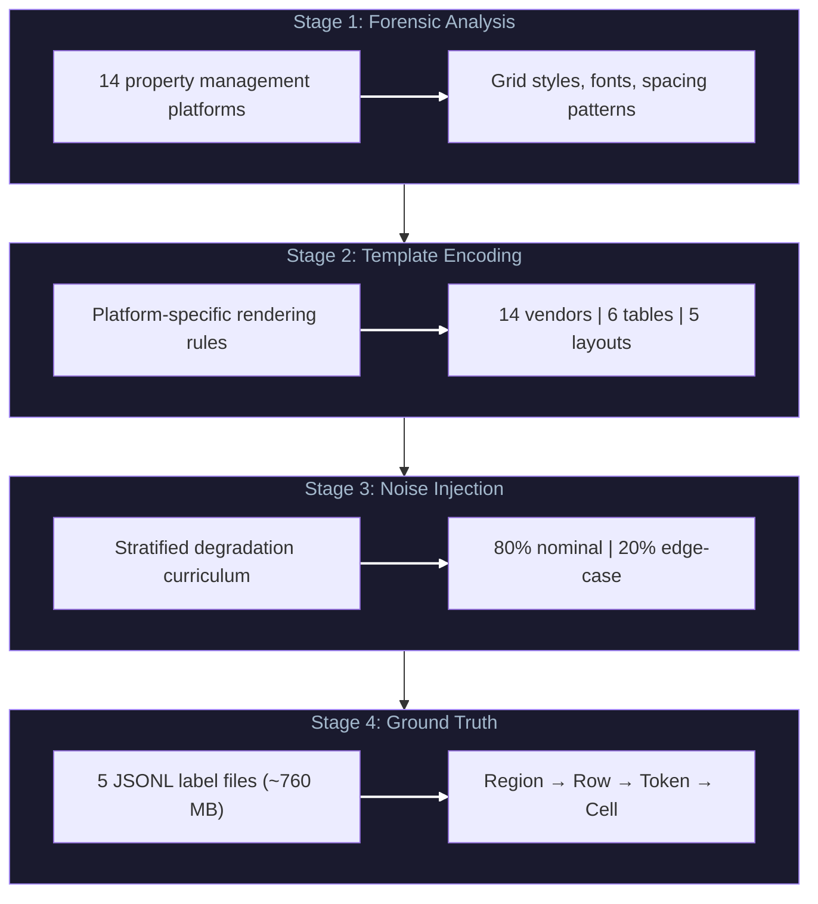

<div align="center">

**Reverse-Engineered PDF Reports for [GLASS Table Extraction System](https://github.com/ges257/glass-extraction)**

[]


[Architecture](ARCHITECTURE.md) · [Challenges](CHALLENGES.md) · [Learnings](LEARNINGS.md)

</div>

---

<div align="center">

In 2026, the constraint is rarely "model code" — it's getting **enough high-quality, compliant data** to train, evaluate, and harden systems for production. This project is an *agentic data factory*:

</div>

## Outcome

Generated **50,000+ structurally-faithful synthetic financial reports** plus **~760MB of ground-truth labels**.
Validated by **training on 100% synthetic data** and transferring to **real production documents** (97%+ table detection, 99.3% row classification) — enabling model development despite strict vendor privacy constraints.

## Technical Build

Reverse-engineered how major reporting platforms **construct PDFs at the object/layout level**, then encoded those rules into deterministic generators so synthetic PDFs match the **parsing behavior** of real reports (not just how they look).

Added a curriculum-based degradation system (layout / formatting / content noise) with an **80/20 nominal vs. edge-case mix** to harden downstream extractors.

---

## The Core Mechanism

```
Forensic Analysis → Template Encoding → Noise Injection → Ground Truth
```

| Stage | Input | Output |
|-------|-------|--------|
| Platform Analysis | Real vendor PDFs | Structural patterns |
| Template Encoding | Patterns | 14 vendor profiles, 5 layouts |
| Noise Injection | Clean templates | 5 degradation levels |
| Ground Truth | Rendered PDFs | Pixel-perfect labels |

---

## Four-Stage Pipeline



---

## Degradation Levels

| Level | Position Jitter | Font Variation | Grid Lines | Curriculum |
|-------|-----------------|----------------|------------|------------|
| 1 Clean | 0.0 pt | 1.0x | 100% | 20% |
| 2 Mild | 1.0 pt | 0.95-1.05x | 95% | 25% |
| 3 Moderate | 2.0 pt | 0.90-1.10x | 85% | 25% |
| 4 Heavy | 3.5 pt | 0.85-1.15x | 70% | 20% |
| 5 Extreme | 5.0 pt | 0.80-1.25x | 50% | 10% |

---

## Validation

Synthetic data was used to train GLASS extraction models:

| Metric | Value |
|--------|-------|
| Model Transfer | Synthetic to Production |
| Table Detection Accuracy | 97%+ |
| Row Classification | 99.3% |
| Corpus Size | 50,000+ PDFs |
| Label Data | 760 MB |

**Critical validation:** Models trained exclusively on synthetic data successfully extracted real-world financial documents with zero real training examples.

---

## Project Structure

```
pdf-synth-engine/
├── src/
│   └── glass_synth/
│       ├── pdf_renderer.py           # ReportLab PDF construction (117 KB)
│       ├── layout_engine.py          # Bbox computation
│       ├── degradation.py            # 5-level noise injection
│       ├── ledger_generator.py       # Accounting data synthesis
│       ├── table_templates.py        # 6 table types, 13 semantic types
│       ├── vendor_styles.py          # 14 vendor profiles
│       ├── companies.py              # Company entity generation
│       ├── cli.py                    # Orchestration
│       ├── config.py                 # YAML configuration
│       ├── labels_writer.py          # Ground-truth generation (20 KB)
│       ├── chart_of_accounts.py      # GL codes
│       └── non_table_regions.py      # Non-table regions
├── configs/
│   └── default.yml                   # Generation configuration
├── docs/
│   └── METHODOLOGY.md                # Full pipeline documentation
└── outputs/                          # Generated PDFs and labels
```

---

## Usage

```bash
# Generate synthetic corpus
python -m glass_synth.cli --num-pdfs 5000 --seed 42 --out-dir outputs/

# Quick test run
python -m glass_synth.cli --num-pdfs 10 --seed 42 --out-dir test_out/

# With custom config
python -m glass_synth.cli --config configs/default.yml
```

---

## License

MIT

---

<div align="center">

**Part of the AI/ML Portfolio**

[Return to Home](https://github.com/ges257/home) | [LinkedIn](https://linkedin.com/in/gregory-e-schwartz)

</div>


